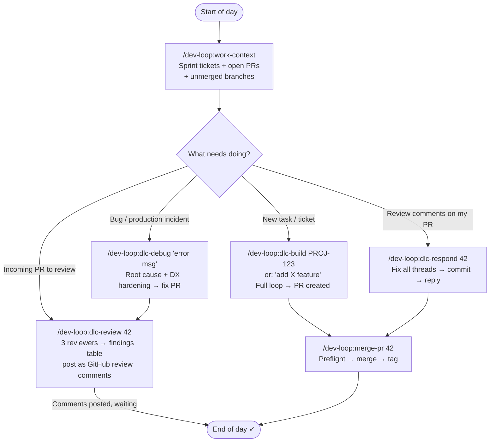
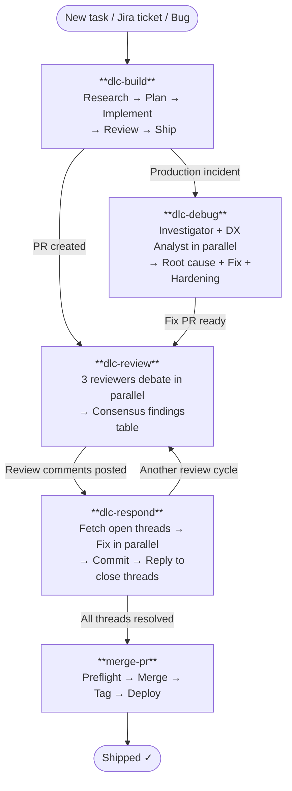
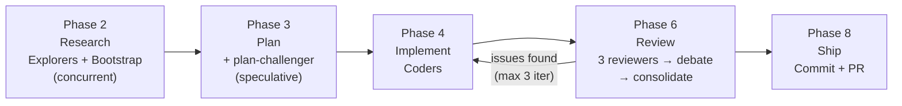

<div align="center">

# dev-loop

**A Claude Code plugin for structured development, PR review, and debugging — powered by Agent Teams.**

[](https://github.com/wasikarn/dev-loop/releases)
[](LICENSE)
[](#skills)
[](#agents)
[](#hooks)

<p>
  <a href="#installation">Installation</a> •
  <a href="#daily-usage">Daily Usage</a> •
  <a href="#full-workflow-example--jira-ticket-to-merged-pr">Workflow Example</a> •
  <a href="#skills">Skills</a> •
  <a href="#agents">Agents</a> •
  <a href="#hooks">Hooks</a> •
  <a href="#output-styles">Output Styles</a> •
  <a href="#jira-integration">Jira</a> •
  <a href="#recommended-ecosystem">Ecosystem</a> •
  <a href="#troubleshooting">Troubleshooting</a>
</p>

</div>

---

## What's Inside

| Component | Count | Purpose |
| --- | --- | --- |
| **Skills** | 12 | Workflow automation — dev loop, PR review, debugging, utilities |
| **Agents** | 23 | Specialized subagents for bootstrapping, reviewing, and committing |
| **Hooks** | 14 | Lifecycle automation — dependency checks, skill routing, quality gates |
| **Output Styles** | 2 | Senior Software Engineer, Coding Mentor |
| **Commands** | 1 | `analyze-claude-features` |

---

## Quick Start

```bash
# 1. Install Homebrew (macOS — skip if already installed)
/bin/bash -c "$(curl -fsSL https://raw.githubusercontent.com/Homebrew/install/HEAD/install.sh)"

# 2. Install required tools
brew install jq gh git

# 3. Authenticate GitHub CLI (choose HTTPS if you don't have SSH keys)
gh auth login

# 4. Add marketplace and install plugin
claude plugin marketplace add wasikarn/dev-loop
claude plugin install dev-loop

# 5. Enable Agent Teams (required for DLC skills)
claude config set env.CLAUDE_CODE_EXPERIMENTAL_AGENT_TEAMS 1
```

Restart Claude Code — the plugin is ready.

---

## Installation

### Option A — Plugin Install (recommended)

#### Step 1 — Install Homebrew (macOS only)

```bash
# Check if Homebrew is installed
brew --version

# If not installed:
/bin/bash -c "$(curl -fsSL https://raw.githubusercontent.com/Homebrew/install/HEAD/install.sh)"
```

> Ubuntu / Debian users: skip this step. Install `jq` via `sudo apt install jq` and `gh` via the [official GitHub CLI instructions](https://cli.github.com/manual/installation).

#### Step 2 — Install required tools

**Required — plugin will not function without these:**

```bash
brew install jq gh git
```

| Tool | Why it's needed |
| --- | --- |
| `jq` | All lifecycle hooks depend on it — missing breaks every hook |
| `gh` (authenticated) | DLC skills need it to fetch PR diffs, post comments, and merge PRs |
| `git` | All DLC skills and hooks depend on git |

**Recommended — plugin degrades gracefully without these:**

| Tool | Without it | Install |
| --- | --- | --- |
| `rtk` | DLC skills work but produce higher token usage | `brew install rtk` |
| `shellcheck` | Auto-validation skipped when Claude writes `.sh` files | `brew install shellcheck` |
| `node` + `markdownlint-cli2` | Auto-lint skipped when Claude edits `.md` files | `brew install node && npm i -g markdownlint-cli2` |
| `fd` | Bootstrap agents fall back to slower Glob search | `brew install fd` |
| `ast-grep` | Bootstrap agents fall back to less precise Grep | `brew install ast-grep` |

#### Step 3 — Authenticate GitHub CLI

```bash
gh auth login
# Choose: GitHub.com → HTTPS → authenticate via browser
```

> **Note:** When prompted for preferred protocol, choose **HTTPS** unless you already have SSH keys configured for GitHub. The plugin installer uses `git clone` to pull this repository — it will use SSH if your git is configured that way, or fall back to HTTPS via the `gh` credential helper.

#### Step 4 — Install the plugin

`claude plugin install` requires a registered marketplace. Add this plugin's marketplace first, then install:

```bash
claude plugin marketplace add wasikarn/dev-loop
claude plugin install dev-loop
```

> **Troubleshooting:** If the `marketplace add` step fails with a permission or authentication error, try the explicit HTTPS URL instead:
>
> ```bash
> claude plugin marketplace add https://github.com/wasikarn/dev-loop.git
> ```

#### Step 5 — Enable Agent Teams

DLC skills (`dlc-build`, `dlc-review`, `dlc-respond`, `dlc-debug`) spawn parallel agents using Agent Teams. Without this flag, they degrade to solo mode.

```bash
claude config set env.CLAUDE_CODE_EXPERIMENTAL_AGENT_TEAMS 1
```

#### Step 6 — Restart Claude Code

Close and reopen Claude Code. On next startup, the plugin automatically checks for missing dependencies and warns you in context if anything is still missing.

#### Step 7 — Verify installation

```bash
claude plugin list
# Expected: dev-loop appears in the list
```

---

### Option B — Local Development (contributors only)

> **Warning:** Do not use this if you already installed via Option A — both methods write to the same `~/.claude/` directories and will conflict.

```bash
# 1. Clone and enter the repo
git clone git@github.com:wasikarn/dev-loop.git && cd dev-loop

# 2. Install prerequisites (same as Option A)

# 3. Symlink all assets to ~/.claude/
bash scripts/link-skill.sh

# 4. Enable Agent Teams
claude config set env.CLAUDE_CODE_EXPERIMENTAL_AGENT_TEAMS 1

# 5. Verify symlinks
bash scripts/link-skill.sh --list
# Expected: all assets show as ✓ linked
```

Skills and agents take effect immediately on file change. Restart Claude Code only for settings changes.

---

### Prerequisites Summary

| Tool | Status | Install |
| --- | --- | --- |
| `git` | Required | `brew install git` (usually pre-installed) |
| `jq` | Required — all hooks fail without it | `brew install jq` |
| `gh` (authenticated) | Required — DLC skills + merge-pr | `brew install gh && gh auth login` |
| `CLAUDE_CODE_EXPERIMENTAL_AGENT_TEAMS=1` | Required — enables Agent Teams for DLC skills | `claude config set env.CLAUDE_CODE_EXPERIMENTAL_AGENT_TEAMS 1` |
| `rtk` | Recommended — reduces token usage in DLC output | `brew install rtk` |
| `shellcheck` | Recommended — auto-validates `.sh` files Claude writes | `brew install shellcheck` |
| `node` + `markdownlint-cli2` | Recommended — auto-lints `.md` files Claude edits | `brew install node && npm i -g markdownlint-cli2` |
| `fd` | Recommended — faster file search in bootstrap agents | `brew install fd` |
| `ast-grep` | Recommended — structural code search in bootstrap agents | `brew install ast-grep` |

---

## Daily Usage

Typical developer day using the DLC workflow:



**Session tips:**

- Start every session with `/dev-loop:work-context` — shows active sprint tickets, open PRs awaiting action, and unmerged branches
- Run `/dev-loop:careful` before risky work (migrations, force-push, DROP TABLE)
- Use `/dev-loop:dlc-metrics` weekly to spot recurring review findings

---

## Full Workflow Example — Jira Ticket to Merged PR

> **PROJ-1234** — "Add rate limiting to auth endpoints"

```bash
# 1. Build the feature
/dev-loop:dlc-build PROJ-1234
# Claude fetches Jira AC → maps auth middleware → writes plan.md →
# implements with tests → 3-reviewer debate → opens PR

# 2. Address reviewer comments
/dev-loop:dlc-respond 42
# Fetches open threads → fixes in parallel → commits → posts replies

# 3. Final review before merge
/dev-loop:dlc-review 42 PROJ-1234 Author
# Three agents re-examine PR against AC → debate → apply remaining fixes

# 4. Merge
/dev-loop:merge-pr 42
# Squash into develop → version bump → CHANGELOG → post-merge verification
```

---

## Skills

### DLC Workflow Skills

The four DLC skills form a complete development loop. Each runs a team of specialized agents that work in parallel, debate findings, and produce structured output.



---

#### `dlc-build` — Full Development Loop

The primary workflow for any coding task. Runs Research → Plan → Implement → Review → Ship with an iterative fix-review loop (max 3 iterations).



**When to use:** New features, bug fixes, refactors, Jira tickets, CI failures, production hotfixes.

**Domain lenses (Phase 6):** Each reviewer automatically receives domain-specific lens files based on diff content — security, database, TypeScript, frontend (RSC/App Router), error handling, API design, observability, and performance. Lens injection is automatic; no configuration needed.

```bash
/dev-loop:dlc-build "add rate limiting to the API"
/dev-loop:dlc-build PROJ-1234           # auto-fetches Jira AC
/dev-loop:dlc-build PROJ-1234 --quick   # skip research for small fixes
/dev-loop:dlc-build PROJ-1234 --hotfix  # urgent production incident
```

| Mode | When to use |
| --- | --- |
| _(default)_ | Auto-classifies based on task scope |
| `--quick` | Small fix with clear scope — skips research phase |
| `--full` | Forces full loop including research |
| `--hotfix` | Branches from `main`, creates backport PR to `develop` |

---

#### `dlc-review` — Adversarial PR Review

Three agents independently review a PR, then debate their findings to eliminate false positives. Output is a single ranked findings table with evidence-backed verdicts.

**Domain lenses:** Each teammate receives diff-content-specific lens files — security, database, TypeScript, frontend, error handling, API design, observability, and performance — injected automatically before review begins.

**When to use:** Any pull request — quick standards check, architecture review, or multi-perspective analysis.

```bash
/dev-loop:dlc-review 42                  # PR number
/dev-loop:dlc-review 42 PROJ-1234        # with Jira AC verification
/dev-loop:dlc-review 42 Author           # apply fixes directly to the branch
/dev-loop:dlc-review 42 Reviewer         # post findings as GitHub review comments
```

| Mode | When to use |
| --- | --- |
| `Author` | You own the PR — Claude applies fixes automatically |
| `Reviewer` | You are reviewing someone else's PR — Claude posts GitHub comments |

**Example output:**

```markdown
## 📋 PR #42 — PROJ-1234 | Author Mode | 🟡

**PR:** feat: add rate limiting to auth endpoints
**Files changed:** 6 | **Lines:** +142 −18

### AC Verification

| AC  | Status      | File                           | Note                    |
| --- | ----------- | ------------------------------ | ----------------------- |
| AC1 | ✅ Done     | `app/middleware/rate-limit.ts` | 5 req/min enforced      |
| AC2 | ✅ Done     | `app/middleware/rate-limit.ts` | 10 req/min enforced     |
| AC3 | 🔴 Partial  | `app/middleware/rate-limit.ts` | Headers set only on 429 |

### Findings (after debate)

| #  | Sev | File                           | Line | Consensus | Issue                                         |
| -- | --- | ------------------------------ | ---- | --------- | --------------------------------------------- |
| 1  | 🔴  | `app/middleware/rate-limit.ts` | 47   | 3/3       | Rate limit headers missing on success (AC3)   |
| 2  | 🟡  | `app/middleware/rate-limit.ts` | 12   | 2/3       | In-memory store resets on restart — use Redis |
| 3  | 🟡  | `tests/rate-limit.spec.ts`     | 88   | 2/3       | Only 429 tested — add success + burst cases   |

### Fixes Applied

| #  | Fix                                        | File                              |
| -- | ------------------------------------------ | --------------------------------- |
| 1  | Add X-RateLimit-* headers to all responses | `app/middleware/rate-limit.ts:47` |
| 2  | Add Redis store note + env guard           | `app/middleware/rate-limit.ts:12` |
| 3  | Add success path + burst edge case tests   | `tests/rate-limit.spec.ts:88`     |

✅ **Validate:** `node ace test --filter rate-limit` — PASS

### Final Verdict

✅ **APPROVE** — Fixed 🔴 1, 🟡 2 | AC: 3/3 ✅ | Signal: 50%
```

---

#### `dlc-respond` — Address PR Review Comments

Fetches all open GitHub review threads on a PR, fixes each issue in parallel, commits the changes, and posts replies to close every thread.

**When to use:** After receiving PR review feedback.

```bash
/dev-loop:dlc-respond 42
/dev-loop:dlc-respond 42 PROJ-1234   # with Jira AC context for prioritization
```

---

#### `dlc-debug` — Parallel Root Cause Analysis

Two agents run in parallel: an Investigator traces the root cause, while a DX Analyst audits the affected area across 19 DX patterns (error handling E1–E8, observability O1–O6, prevention P1–P5). A Fixer agent then applies the fix; an optional Fix Reviewer checks safety patterns including TOCTOU, null paths, and race conditions.

**When to use:** Complex bugs, production incidents, or when you want to harden the affected area alongside the fix.

```bash
/dev-loop:dlc-debug "NullPointerException in UserService"
/dev-loop:dlc-debug PROJ-5678           # from a Jira bug ticket
/dev-loop:dlc-debug PROJ-5678 --quick   # fix only, skip DX analysis
/dev-loop:dlc-debug PROJ-5678 --review  # add Fix Reviewer after Fixer (forced on P0)
```

---

### Utility Skills

#### `merge-pr` — Git-flow Merge & Deploy

Automates the merge and release process: version bumps, CHANGELOG updates, tags, backport PRs, and post-merge verification.

```bash
/dev-loop:merge-pr 42           # feature/bugfix → develop
/dev-loop:merge-pr --hotfix     # hotfix → main + backport to develop
/dev-loop:merge-pr --release    # release → main + tag + backport
```

**Requires:** `gh` CLI (authenticated), clean working tree, GitHub remote.

---

#### `optimize-context` — Audit CLAUDE.md

Scores a CLAUDE.md across quality dimensions, identifies bloat and gaps, and rewrites sections to be more useful for Claude.

```bash
/dev-loop:optimize-context
/dev-loop:optimize-context --dry-run    # preview without editing
/dev-loop:optimize-context --coverage   # include coverage analysis
```

---

#### `env-heal` — Fix Environment Variables

Scans for all env var references, cross-references against the validation schema and `.env.example`, classifies gaps, auto-fixes discrepancies, and runs tests to verify.

```bash
/dev-loop:env-heal          # full scan and fix
/dev-loop:env-heal --quick  # schema vs .env.example only
```

**Supports:** AdonisJS (`Env.schema`), dotenv (`.env.example`), and any Node.js project.

---

#### `systems-thinking` — Causal Loop Analysis

Maps causal loops, identifies feedback cycles, and surfaces second-order effects before committing to an architecture decision.

```bash
/dev-loop:systems-thinking "should we move to microservices?"
/dev-loop:systems-thinking "what happens if we remove the cache layer?"
```

---

#### `dlc-metrics` — Retrospective Report

Reads `~/.claude/dlc-metrics.jsonl` and produces a retrospective: iteration counts, critical finding categories, recurrent issues, and Hard Rule candidates.

```bash
/dev-loop:dlc-metrics
```

---

#### `dlc-onboard` — Bootstrap a New Project

Scaffolds the dev-loop ecosystem into a new project: generates `hard-rules.md` with stack-appropriate starter rules and creates the `dlc-build` artifact directory.

```bash
/dev-loop:dlc-onboard
```

---

#### `careful` — Safe Mode

Activates session-level protection that blocks destructive bash commands: `rm -rf`, `DROP TABLE`, `git push --force`, `truncate`, `git reset --hard` on committed work.

```bash
/dev-loop:careful
```

**When to use:** Working near production data, shared branches, or irreversible operations.

---

#### `freeze` — Directory Lock

Locks edits to a specific directory for the session. Claude will refuse to edit files outside the target path.

```bash
/dev-loop:freeze src/auth     # lock edits to src/auth/
/dev-loop:freeze tests/       # only touch tests/
```

---

### Skill Guides

Detailed contributor docs for each skill live in `skills/<name>/CLAUDE.md`. For skill creation guidelines and best practices, see [`docs/references/`](docs/references/).

---

## Agents

Specialized subagents spawned automatically by DLC skills. Can also be invoked directly.

| Agent | Model | Invoked by | Purpose |
| --- | --- | --- | --- |
| `commit-finalizer` | Haiku | Manually | Fast git commit with conventional commit formatting |
| `dev-loop-bootstrap` | Haiku | `dlc-build` Phase 2 | Pre-gathers project structure and type definitions |
| `dlc-debug-bootstrap` | Haiku | `dlc-debug` Phase 1 | Pre-gathers stack trace context and affected files |
| `dlc-respond-bootstrap` | Haiku | `dlc-respond` Phase 1 | Pre-gathers open PR threads and affected files |
| `pr-review-bootstrap` | Haiku | `dlc-review` Phase 1 | Fetches PR diff, Jira AC, and groups changed files |
| `review-consolidator` | Haiku | `dlc-review` Phase 5 | Deduplicates and ranks findings from multiple reviewers |
| `research-validator` | Haiku | `dlc-build` Phase 2→3 gate | Validates research.md completeness (file:line evidence) |
| `fix-intent-verifier` | Haiku | `dlc-respond` Phase 2 | Verifies each fix addresses reviewer intent (ADDRESSED/PARTIAL/MISALIGNED) |
| `jira-sync` | Haiku | `dlc-build`/`dlc-debug` end | Posts ADF implementation summary to Jira; AC coverage check; optional status transition; spawns atlassian-pm agents when available |
| `work-context` | Haiku | Session start | Sprint tickets + PRs awaiting action + unmerged branches digest |
| `merge-preflight` | Haiku | `merge-pr` Confirmation Gate | Pre-merge go/no-go safety checklist |
| `metrics-analyst` | Haiku | `dlc-metrics` | Retrospective from dlc-metrics.jsonl: iteration patterns and Hard Rule candidates |
| `falsification-agent` | Sonnet | `dlc-build` Phase 6, `dlc-review` Phase 5 | Challenges every finding — outputs SUSTAINED/DOWNGRADED/REJECTED per finding |
| `plan-challenger` | Sonnet | `dlc-build` Phase 3 gate | Challenges plan for YAGNI/scope/ordering issues before implementation |
| `test-quality-reviewer` | Sonnet | `dlc-review` Phase 3 | Test quality (T1–T9): behavior vs implementation, mock fidelity, assertion presence |
| `migration-reviewer` | Sonnet | `dlc-review` Phase 3 | DB migration safety (M1–M10): DDL reversibility, FK indexes, table-lock risk |
| `api-contract-auditor` | Sonnet | `dlc-review` Phase 3 | API breaking changes (A1–A10): removed fields, status codes, required params |
| `skill-validator` | Sonnet | Manually | Validates SKILL.md frontmatter and description quality |
| `project-onboarder` | Sonnet | `dlc-onboard` | Scaffolds hard-rules.md and dlc-build directory for new projects |
| `code-explorer` | Sonnet | Manually | Traces execution paths and maps feature architecture — read-only, no code changes |
| `comment-analyzer` | Sonnet | Manually / `dlc-build` Phase 4 (optional) | Verifies comment accuracy against code; flags stale references and comment rot |
| `code-simplifier` | Sonnet | Manually / `dlc-build` Phase 7 (optional) | Simplifies recently changed code for clarity and maintainability without altering behavior |
| `code-reviewer` | Sonnet | Manually | General-purpose code reviewer with cross-session persistent memory; includes 6 inline domain lenses (security, database, TypeScript, frontend, error handling, API design) applied per diff content |

---

## Hooks

Distributed automatically with the plugin — no manual configuration required.

| Hook | Event | What it does |
| --- | --- | --- |
| `check-deps.sh` | `SessionStart` | Warns in context if `jq`, `git`, or `gh` are missing |
| `session-start-context.sh` | `SessionStart` | Injects current git branch and uncommitted file count |
| `skill-routing.sh` | `UserPromptSubmit` | Detects workflow keywords and suggests the matching skill |
| `protect-files.sh` | `PreToolUse[Edit\|Write]` | Blocks Claude from editing `.claude/settings.json` directly |
| `skill-usage-tracker.sh` | `PreToolUse[Skill]` | Logs skill invocations for analytics and usage tracking |
| `permission-router.sh` | `PreToolUse[Bash]` | Routes bash commands through permission checks (e.g. `/careful` blocks) |
| _(inline)_ | `PostToolUse[Edit\|Write]` | Auto-lints `.md` files with `markdownlint-cli2 --fix` |
| `shellcheck-written-scripts.sh` | `PostToolUse[Write]` | Auto-validates `.sh` files Claude writes |
| `task-gate.sh` | `TaskCompleted` | Requires `file:line` evidence before agent tasks are marked complete |
| `idle-nudge.sh` | `TeammateIdle` | Nudges idle Agent Teams teammates back on task |
| `post-compact-context.sh` | `PostCompact` | Re-injects session context after compaction |
| `bash-failure-hint.sh` | `PostToolUseFailure[Bash]` | Injects diagnostic hints after Bash tool failures |
| `stop-failure-log.sh` | `StopFailure` | Logs API errors (rate limit, token overflow) to session log |
| `subagent-stop-gate.sh` | `SubagentStop` | Blocks reviewer agents that finish without `file:line` evidence |

### Skill Routing Keywords

`skill-routing.sh` detects these patterns and suggests a skill before Claude responds:

| Pattern | Suggested skill |
| --- | --- |
| `bug`, `broken`, `failing`, `crash`, `test fail` | `dlc-debug` |
| `ready to merge`, `feature complete`, `ready for PR` | `dlc-review` → ship workflow |
| `review PR`, `review pull request`, `review code` | `dlc-review` |
| `implement`, `add feature`, `build component`, `create page` | `dlc-build` |

---

## Output Styles

Activate an output style to change how Claude communicates throughout a session.

| Style | Activate with | Description |
| --- | --- | --- |
| `senior-software-engineer` | `/output-style senior-software-engineer` | Thai language. Pragmatic senior engineer tone — trade-offs, production quality, practical solutions. |
| `coding-mentor` | `/output-style coding-mentor` | Thai language. Teaches through doing — adds concise "Why" explanations after significant changes. Good for onboarding. |

---

## Jira Integration

Pass a Jira ticket key (e.g. `PROJ-123`) to any DLC skill and it auto-fetches the issue's acceptance criteria. Requires one of these MCP servers:

| MCP Server | Notes | Install |
| --- | --- | --- |
| `mcp-atlassian` | Direct Jira API | [sooperset/mcp-atlassian](https://github.com/sooperset/mcp-atlassian) |
| `jira-cache-server` | Cached, faster for large projects | [wasikarn/jira-cache-server](https://github.com/wasikarn/jira-cache-server) |

> Jira is optional — skills skip it silently and continue normally if not configured.

---

## Recommended Ecosystem

### Complementary Claude Code Plugins

```bash
claude plugin install <name>
```

| Plugin | Why it's worth installing |
| --- | --- |
| `superpowers@claude-plugins-official` | Core workflow skills — TDD, systematic debugging, verification before claiming done. Prevents common AI failure modes. |
| `claude-mem@thedotmack` | Cross-session persistent memory. Claude remembers past decisions and project context across conversations. |
| `qmd@qmd` | Local semantic search over your codebase and docs. Speeds up `dlc-build` research phase significantly. |
| `feature-dev@claude-plugins-official` | Specialized subagents for feature exploration and architecture analysis. Pairs well with `dlc-build`. |
| `commit-commands@claude-plugins-official` | Quick `/commit` and `/commit-push-pr` skills for the Ship phase of `dlc-build`. |
| `playwright@claude-plugins-official` | Browser automation via MCP. Useful for `dlc-debug` when diagnosing UI or end-to-end failures. |
| `typescript-lsp@claude-plugins-official` | TypeScript language server — real-time type errors and go-to-definition. Reduces hallucinated types in TypeScript projects. |
| `pr-review-toolkit@claude-plugins-official` | Additional review agents (silent-failure hunter, type-design analyzer, test coverage analyzer). Complements `dlc-review`. |

### Complementary MCP Servers

All optional — skills degrade gracefully if absent.

| MCP Server | When it helps | Install |
| --- | --- | --- |
| `context7` | Fetches up-to-date library docs during `dlc-build` research — no more hallucinated API signatures. | [upstash/context7-mcp](https://github.com/upstash/context7-mcp) |
| `sequential-thinking` | Structured reasoning for complex decisions. Useful in `systems-thinking` and `dlc-build` planning. | `claude mcp add sequential-thinking` |
| `figma` | Pulls Figma frames into context. Lets `dlc-build` use actual design specs instead of descriptions. | [GLips/Figma-Context-MCP](https://github.com/GLips/Figma-Context-MCP) |
| `mcp-atlassian` | Jira + Confluence access. `dlc-build` uses Confluence pages as additional AC context. | [sooperset/mcp-atlassian](https://github.com/sooperset/mcp-atlassian) |

---

## Troubleshooting

### DLC skills do nothing / no agents spawn

Agent Teams must be enabled:

```bash
claude config set env.CLAUDE_CODE_EXPERIMENTAL_AGENT_TEAMS 1
```

Restart Claude Code after setting.

### Skills not triggering automatically

Verify the plugin is installed:

```bash
claude plugin list   # dev-loop should appear
```

If missing, reinstall:

```bash
claude plugin marketplace add wasikarn/dev-loop
claude plugin install dev-loop
```

### Warning about missing tools at session start

Install the flagged tools, then restart Claude Code:

```bash
brew install jq gh && gh auth login
```

### Jira context not loading

Jira is optional. Configure `mcp-atlassian` or `jira-cache-server` if you want it. See [Jira Integration](#jira-integration).

### Plugin skills show as `dev-loop:skill-name`

This is correct — skills installed via plugin are namespaced automatically to avoid conflicts with other plugins.

### Symlinked hooks not running (local dev)

Verify symlinks exist:

```bash
bash scripts/link-skill.sh --list
```

Re-run `bash scripts/link-skill.sh` if any are missing.

---

## Repo Structure

```text
dev-loop/
├── .claude-plugin/
│   └── plugin.json           # Plugin manifest
├── skills/                   # Skill entry points (SKILL.md per skill)
│   ├── dlc-build/
│   ├── dlc-review/
│   ├── dlc-respond/
│   ├── dlc-debug/
│   ├── merge-pr/
│   ├── optimize-context/
│   ├── env-heal/
│   ├── systems-thinking/
│   ├── dlc-metrics/
│   ├── dlc-onboard/
│   ├── careful/
│   └── freeze/
├── agents/                   # Custom subagent definitions (.md files)
├── hooks/                    # Plugin-distributed lifecycle hook scripts
│   └── hooks.json            # Plugin hook registry (auto-loaded on install)
├── output-styles/            # Custom output styles
├── scripts/                  # Dev tooling (link-skill.sh, fix-tables.sh, detect-project.sh)
└── docs/
    └── references/           # Contributor reference docs (best practices, creation guides)
```

---

## Contributing

See [CONTRIBUTING.md](CONTRIBUTING.md) for local development setup, how to add new skills, and linting instructions.

---

## License

[MIT](LICENSE) — © [kobig](https://github.com/wasikarn)
