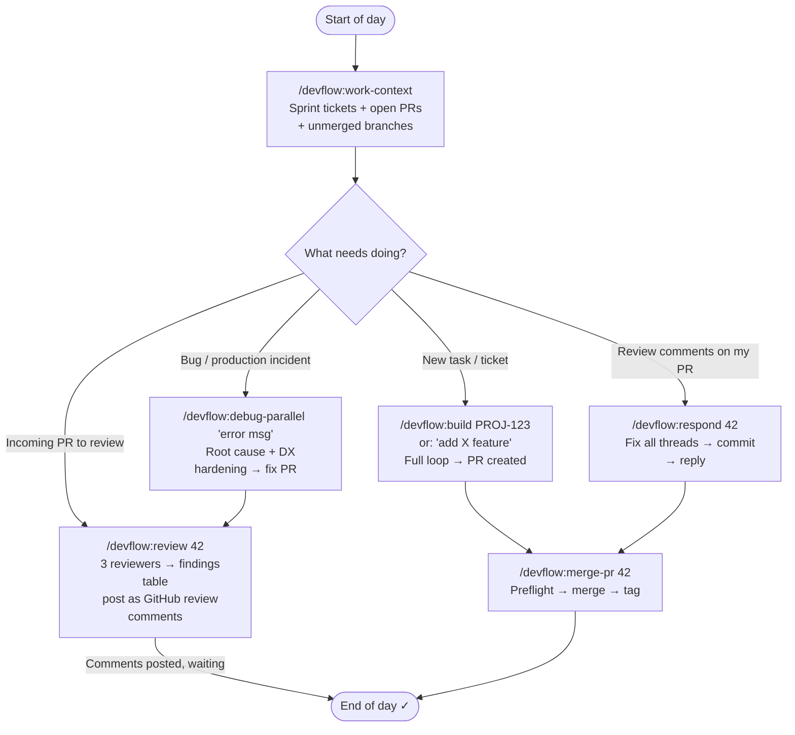
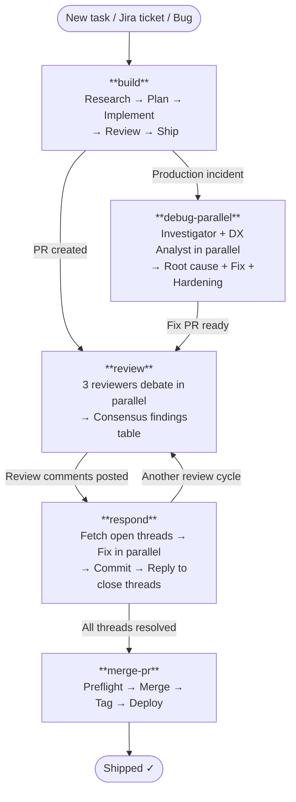
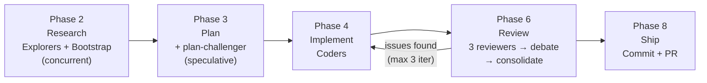

<div align="center">

# devflow

**A Claude Code plugin for structured development, PR review, and debugging — powered by Agent Teams.**

[](https://github.com/wasikarn/devflow/releases)
[](LICENSE)
[](#skills)
[](#agents)
[](#hooks)

<p>
  <a href="#installation">Installation</a> •
  <a href="#daily-usage">Daily Usage</a> •
  <a href="#full-workflow-example--jira-ticket-to-merged-pr">Workflow Example</a> •
  <a href="#skills">Skills</a> •
  <a href="#agents">Agents</a> •
  <a href="#hooks">Hooks</a> •
  <a href="#output-styles">Output Styles</a> •
  <a href="#jira-integration">Jira</a> •
  <a href="#recommended-ecosystem">Ecosystem</a> •
  <a href="#troubleshooting">Troubleshooting</a>
</p>

</div>

> **Note:** This plugin is not related to [Foundry's devflow](https://github.com/foundry-rs/foundry) (Ethereum tooling).

---

## Concept

### Devflow = Agent Teams + Structured Workflows

Traditional AI assistants work solo — one agent handles everything from research to implementation to review. Devflow takes a different approach: **parallel agents that specialize and debate**.

**Core ideas:**

1. **Parallel Agents** — Multiple specialized agents work concurrently (3 reviewers debate findings, investigator + DX analyst debug together)
2. **Debate Protocol** — Agents challenge each other's findings to eliminate false positives before consolidating results
3. **Workflow Automation** — Skills chain together: build → review → respond → merge, with context carried through each phase
4. **Evidence Gates** — Every finding requires file:line citations; agents can't claim "done" without proof

**Benefits:**

- ⚡ **Faster cycles** — Agents run in parallel, not sequentially
- 🎯 **Higher accuracy** — Debate filters false positives
- 📊 **Audit trails** — All findings cite specific code locations
- 🔄 **Context persistence** — Jira AC, PR diffs, and previous findings flow through phases

**How it works:**

```text
User: /devflow:build PROJ-123
  ↓
Lead Agent fetches Jira AC → spawns Explorer agents (parallel)
  ↓
Planner creates implementation.md → spawns Coder agents
  ↓
Review Team (3 agents) debates findings → consolidates
  ↓
Fixer applies changes → creates PR
  ↓
Done (or review cycle if issues found)
```

---

## What's Inside

| Component | Count | Purpose |
| --- | --- | --- |
| **Skills** | 29 | Workflow automation — dev loop, PR review, debugging, utilities |
| **Agents** | 27 | Specialized subagents for bootstrapping, reviewing, committing |
| **Hooks** | 17 | Lifecycle automation — dependency checks, context injection, quality gates |
| **Output Styles** | 4 | Senior Software Engineer, Coding Mentor (Thai + English) |
| **SDK** | 1 | `devflow-engine` — TypeScript SDK for programmatic PR review |

---

## Quick Start

```bash
# 1. Install Homebrew (macOS — skip if already installed)
/bin/bash -c "$(curl -fsSL https://raw.githubusercontent.com/Homebrew/install/HEAD/install.sh)"

# 2. Install required tools
brew install jq gh git

# 3. Authenticate GitHub CLI (choose HTTPS if you don't have SSH keys)
gh auth login

# 4. Add marketplace and install plugin
claude plugin marketplace add wasikarn/devflow
claude plugin install devflow

# 5. Enable Agent Teams (required for Devflow skills)
claude config set env.CLAUDE_CODE_EXPERIMENTAL_AGENT_TEAMS 1
```

Restart Claude Code — the plugin is ready.

---

## Installation

### Option A — Plugin Install (recommended)

#### Step 1 — Install Homebrew (macOS only)

```bash
# Check if Homebrew is installed
brew --version

# If not installed:
/bin/bash -c "$(curl -fsSL https://raw.githubusercontent.com/Homebrew/install/HEAD/install.sh)"
```

> Ubuntu / Debian users: skip this step. Install `jq` via `sudo apt install jq` and `gh` via the [official GitHub CLI instructions](https://cli.github.com/manual/installation).

#### Step 2 — Install required tools

**Required — plugin will not function without these:**

```bash
brew install jq gh git
```

| Tool | Why it's needed |
| --- | --- |
| `jq` | All lifecycle hooks depend on it — missing breaks every hook |
| `gh` (authenticated) | Devflow skills need it to fetch PR diffs, post comments, and merge PRs |
| `git` | All Devflow skills and hooks depend on git |

**Recommended — plugin degrades gracefully without these:**

| Tool | Without it | Install |
| --- | --- | --- |
| `rtk` | Devflow skills work but produce higher token usage | `brew install rtk` |
| `shellcheck` | Auto-validation skipped when Claude writes `.sh` files | `brew install shellcheck` |
| `node` + `markdownlint-cli2` | Auto-lint skipped when Claude edits `.md` files | `brew install node && npm i -g markdownlint-cli2` |
| `fd` | Bootstrap agents fall back to slower Glob search | `brew install fd` |
| `ast-grep` | Bootstrap agents fall back to less precise Grep | `brew install ast-grep` |

#### Step 3 — Authenticate GitHub CLI

```bash
gh auth login
# Choose: GitHub.com → HTTPS → authenticate via browser
```

> **Note:** When prompted for preferred protocol, choose **HTTPS** unless you already have SSH keys configured for GitHub. The plugin installer uses `git clone` to pull this repository — it will use SSH if your git is configured that way, or fall back to HTTPS via the `gh` credential helper.

#### Step 4 — Install the plugin

`claude plugin install` requires a registered marketplace. Add this plugin's marketplace first, then install:

```bash
claude plugin marketplace add wasikarn/devflow
claude plugin install devflow
```

> **Troubleshooting:** If the `marketplace add` step fails with a permission or authentication error, try the explicit HTTPS URL instead:
>
> ```bash
> claude plugin marketplace add https://github.com/wasikarn/devflow.git
> ```

#### Step 5 — Enable Agent Teams

Devflow skills (`build`, `review`, `respond`, `debug-parallel`) spawn parallel agents using Agent Teams. Without this flag, they degrade to solo mode.

```bash
claude config set env.CLAUDE_CODE_EXPERIMENTAL_AGENT_TEAMS 1
```

#### Step 6 — Restart Claude Code

Close and reopen Claude Code. On next startup, the plugin automatically checks for missing dependencies and warns you in context if anything is still missing.

#### Step 7 — Verify installation

```bash
claude plugin list
# Expected: devflow appears in the list
```

---

### Option B — Local Development (contributors only)

> **Warning:** Do not use this if you already installed via Option A — both methods write to the same `~/.claude/` directories and will conflict.

```bash
# 1. Clone and enter the repo
git clone git@github.com:wasikarn/devflow.git && cd devflow

# 2. Install prerequisites (same as Option A)

# 3. Symlink all assets to ~/.claude/
bash scripts/link-assets.sh

# 4. Enable Agent Teams
claude config set env.CLAUDE_CODE_EXPERIMENTAL_AGENT_TEAMS 1

# 5. Verify symlinks
bash scripts/link-assets.sh --list
# Expected: all assets show as ✓ linked
```

Skills and agents take effect immediately on file change. Restart Claude Code only for settings changes.

---

### Prerequisites Summary

| Tool | Status | Install |
| --- | --- | --- |
| `git` | Required | `brew install git` (usually pre-installed) |
| `jq` | Required — all hooks fail without it | `brew install jq` |
| `gh` (authenticated) | Required — Devflow skills + merge-pr | `brew install gh && gh auth login` |
| `CLAUDE_CODE_EXPERIMENTAL_AGENT_TEAMS=1` | Required — enables Agent Teams for Devflow skills | `claude config set env.CLAUDE_CODE_EXPERIMENTAL_AGENT_TEAMS 1` |
| `rtk` | Recommended — reduces token usage in Devflow output | `brew install rtk` |
| `shellcheck` | Recommended — auto-validates `.sh` files Claude writes | `brew install shellcheck` |
| `node` + `markdownlint-cli2` | Recommended — auto-lints `.md` files Claude edits | `brew install node && npm i -g markdownlint-cli2` |
| `fd` | Recommended — faster file search in bootstrap agents | `brew install fd` |
| `ast-grep` | Recommended — structural code search in bootstrap agents | `brew install ast-grep` |

---

## Daily Usage

Typical developer day using the Devflow workflow:



**Session tips:**

- Start every session with `/devflow:work-context` — shows active sprint tickets, open PRs awaiting action, and unmerged branches
- Run `/devflow:careful` before risky work (migrations, force-push, DROP TABLE)
- Use `/devflow:metrics` weekly to spot recurring review findings

---

## Full Workflow Example — Jira Ticket to Merged PR

> **PROJ-1234** — "Add rate limiting to auth endpoints"

```bash
# 1. Build the feature
/devflow:build PROJ-1234
# Claude fetches Jira AC → maps auth middleware → writes plan.md →
# implements with tests → 3-reviewer debate → opens PR

# 2. Address reviewer comments
/devflow:respond 42
# Fetches open threads → fixes in parallel → commits → posts replies

# 3. Final review before merge
/devflow:review 42 PROJ-1234 Author
# Three agents re-examine PR against AC → debate → apply remaining fixes

# 4. Merge
/devflow:merge-pr 42
# Squash into develop → version bump → CHANGELOG → post-merge verification
```

---

## Skills

### Devflow Workflow Skills

The four Devflow skills form a complete development loop. Each runs a team of specialized agents that work in parallel, debate findings, and produce structured output.



---

#### `build` — Full Development Loop

The primary workflow for any coding task. Runs Research → Plan → Implement → Review → Ship with an iterative fix-review loop (max 3 iterations).



**When to use:** New features, bug fixes, refactors, Jira tickets, CI failures, production hotfixes.

**Domain lenses (Phase 6):** Each reviewer automatically receives domain-specific lens files based on diff content — security, database, TypeScript, frontend (RSC/App Router), error handling, API design, observability, and performance. Lens injection is automatic; no configuration needed.

```bash
/devflow:build "add rate limiting to the API"
/devflow:build PROJ-1234           # auto-fetches Jira AC
/devflow:build PROJ-1234 --quick   # skip research for small fixes
/devflow:build PROJ-1234 --hotfix  # urgent production incident
```

| Mode | When to use |
| --- | --- |
| _(default)_ | Auto-classifies based on task scope |
| `--quick` | Small fix with clear scope — skips research phase |
| `--full` | Forces full loop including research |
| `--hotfix` | Branches from `main`, creates backport PR to `develop` |

---

#### `review` — Adversarial PR Review

Three agents independently review a PR, then debate their findings to eliminate false positives. Output is a single ranked findings table with evidence-backed verdicts.

**Domain lenses:** Each teammate receives diff-content-specific lens files — security, database, TypeScript, frontend, error handling, API design, observability, and performance — injected automatically before review begins.

**When to use:** Any pull request — quick standards check, architecture review, or multi-perspective analysis.

```bash
/devflow:review 42                  # PR number
/devflow:review 42 PROJ-1234        # with Jira AC verification
/devflow:review 42 Author           # apply fixes directly to the branch
/devflow:review 42 Reviewer         # post findings as GitHub review comments
```

| Mode | When to use |
| --- | --- |
| `Author` | You own the PR — Claude applies fixes automatically |
| `Reviewer` | You are reviewing someone else's PR — Claude posts GitHub comments |

**Example output:**

```markdown
## 📋 PR #42 — PROJ-1234 | Author Mode | 🟡

**PR:** feat: add rate limiting to auth endpoints
**Files changed:** 6 | **Lines:** +142 −18

### AC Verification

| AC  | Status      | File                           | Note                    |
| --- | ----------- | ------------------------------ | ----------------------- |
| AC1 | ✅ Done     | `app/middleware/rate-limit.ts` | 5 req/min enforced      |
| AC2 | ✅ Done     | `app/middleware/rate-limit.ts` | 10 req/min enforced     |
| AC3 | 🔴 Partial  | `app/middleware/rate-limit.ts` | Headers set only on 429 |

### Findings (after debate)

| #  | Sev | File                           | Line | Consensus | Issue                                         |
| -- | --- | ------------------------------ | ---- | --------- | --------------------------------------------- |
| 1  | 🔴  | `app/middleware/rate-limit.ts` | 47   | 3/3       | Rate limit headers missing on success (AC3)   |
| 2  | 🟡  | `app/middleware/rate-limit.ts` | 12   | 2/3       | In-memory store resets on restart — use Redis |
| 3  | 🟡  | `tests/rate-limit.spec.ts`     | 88   | 2/3       | Only 429 tested — add success + burst cases   |

### Fixes Applied

| #  | Fix                                        | File                              |
| -- | ------------------------------------------ | --------------------------------- |
| 1  | Add X-RateLimit-* headers to all responses | `app/middleware/rate-limit.ts:47` |
| 2  | Add Redis store note + env guard           | `app/middleware/rate-limit.ts:12` |
| 3  | Add success path + burst edge case tests   | `tests/rate-limit.spec.ts:88`     |

✅ **Validate:** `node ace test --filter rate-limit` — PASS

### Final Verdict

✅ **APPROVE** — Fixed 🔴 1, 🟡 2 | AC: 3/3 ✅ | Signal: 50%
```

---

#### `respond` — Address PR Review Comments

Fetches all open GitHub review threads on a PR, fixes each issue in parallel, commits the changes, and posts replies to close every thread.

**When to use:** After receiving PR review feedback.

```bash
/devflow:respond 42
/devflow:respond 42 PROJ-1234   # with Jira AC context for prioritization
```

---

#### `debug-parallel` — Parallel Root Cause Analysis

Two agents run in parallel: an Investigator traces the root cause, while a DX Analyst audits the affected area across 19 DX patterns (error handling E1–E8, observability O1–O6, prevention P1–P5). A Fixer agent then applies the fix; an optional Fix Reviewer checks safety patterns including TOCTOU, null paths, and race conditions.

**When to use:** Complex bugs, production incidents, or when you want to harden the affected area alongside the fix.

```bash
/devflow:debug-parallel "NullPointerException in UserService"
/devflow:debug-parallel PROJ-5678           # from a Jira bug ticket
/devflow:debug-parallel PROJ-5678 --quick   # fix only, skip DX analysis
/devflow:debug-parallel PROJ-5678 --review  # add Fix Reviewer after Fixer (forced on P0)
```

---

### Utility Skills

#### `merge-pr` — Git-flow Merge & Deploy

Automates the merge and release process: version bumps, CHANGELOG updates, tags, backport PRs, and post-merge verification.

```bash
/devflow:merge-pr 42           # feature/bugfix → develop
/devflow:merge-pr --hotfix     # hotfix → main + backport to develop
/devflow:merge-pr --release    # release → main + tag + backport
```

**Requires:** `gh` CLI (authenticated), clean working tree, GitHub remote.

---

#### `optimize-claude-md` — Audit CLAUDE.md

Scores a CLAUDE.md across quality dimensions, identifies bloat and gaps, and rewrites sections to be more useful for Claude.

```bash
/devflow:optimize-claude-md
/devflow:optimize-claude-md --dry-run    # preview without editing
/devflow:optimize-claude-md --coverage   # include coverage analysis
```

---

#### `env-heal` — Fix Environment Variables

Scans for all env var references, cross-references against the validation schema and `.env.example`, classifies gaps, auto-fixes discrepancies, and runs tests to verify.

```bash
/devflow:env-heal          # full scan and fix
/devflow:env-heal --quick  # schema vs .env.example only
```

**Supports:** AdonisJS (`Env.schema`), dotenv (`.env.example`), and any Node.js project.

---

#### `systems-thinking` — Causal Loop Analysis

Maps causal loops, identifies feedback cycles, and surfaces second-order effects before committing to an architecture decision.

```bash
/devflow:systems-thinking "should we move to microservices?"
/devflow:systems-thinking "what happens if we remove the cache layer?"
```

---

#### `metrics` — Retrospective Report

Reads `~/.claude/devflow-metrics.jsonl` and produces a retrospective: iteration counts, critical finding categories, recurrent issues, and Hard Rule candidates.

```bash
/devflow:metrics
```

---

#### `onboard` — Bootstrap a New Project

Scaffolds the devflow ecosystem into a new project: generates `hard-rules.md` with stack-appropriate starter rules and creates the `build` artifact directory.

```bash
/devflow:onboard
```

---

#### `careful` — Safe Mode

Activates session-level protection that blocks destructive bash commands: `rm -rf`, `DROP TABLE`, `git push --force`, `truncate`, `git reset --hard` on committed work.

```bash
/devflow:careful
```

**When to use:** Working near production data, shared branches, or irreversible operations.

---

#### `freeze` — Directory Lock

Locks edits to a specific directory for the session. Claude will refuse to edit files outside the target path.

```bash
/devflow:freeze src/auth     # lock edits to src/auth/
/devflow:freeze tests/       # only touch tests/
```

---

#### `status` — Session Artifact Browser

Shows active Devflow workflow artifacts from the current session — artifact directories, current phase, and pending actions.

```bash
/devflow:status
```

---

#### `plugin-qa` — Plugin QA Suite

Runs the full QA check suite to verify hooks, skills, and plugin structure are healthy. Runs shellcheck, markdownlint, bats tests, and `claude plugin validate`.

```bash
/devflow:plugin-qa
```

**When to use:** Before releasing a new version of devflow.

---

#### `setup` — Post-Install Setup

Installs `devflow-engine` dependencies via `bun install` and runs a smoke test. Idempotent — detects what is already configured and skips those steps.

```bash
/devflow:setup
```

**When to use:** After installing or reinstalling the plugin. Not for project onboarding (use `/devflow:onboard` instead).

---

#### `analyze-claude-features` — Claude Feature Adoption Audit

Audits the current project against all official Claude Code features and scores adoption coverage. Reports which features are used, unused, or partially adopted.

```bash
/devflow:analyze-claude-features
```

---

#### `promote-hard-rule` — Hard Rule Promotion

Reviews auto-detected Hard Rule candidates from `metrics-analyst` and walks through approve / reject / defer for each candidate. Never auto-applies rules.

```bash
/devflow:promote-hard-rule
```

**When to use:** After running `/devflow:metrics` when candidates are flagged.

---

#### `generate-tests` — Test Generation

Detects the test framework in use (vitest/jest/bun/japa), generates tests following existing conventions, and self-reviews via `test-quality-reviewer`.

```bash
/devflow:generate-tests src/auth/middleware.ts
/devflow:generate-tests src/auth/            # all files in directory
```

---

#### `refactor` — Safe Refactoring

Refactors code with a safety net: runs tests before and after to verify no behavior changes.

```bash
/devflow:refactor src/utils/parser.ts --simplify    # delegate to code-simplifier
/devflow:refactor src/utils/parser.ts --extract     # extract function/module
/devflow:refactor src/utils/parser.ts --restructure # structural reorganization
```

---

#### `audit` — Security & Dependency Audit

Runs a security and/or dependency audit. `--security` spawns the `security-reviewer` agent; `--deps` runs `npm audit` or `pip-audit`.

```bash
/devflow:audit --deps       # dependency vulnerability scan
/devflow:audit --security   # OWASP-focused code security review
/devflow:audit --all        # both
```

---

#### `generate-docs` — Documentation Generation

Generates documentation from source code. Supports API docs, README sections, and inline JSDoc/TSDoc.

```bash
/devflow:generate-docs --api src/routes/      # OpenAPI-style endpoint docs
/devflow:generate-docs --readme               # update README from code
/devflow:generate-docs --inline src/auth/     # add JSDoc/TSDoc comments
```

---

#### `dashboard` — Metrics Dashboard

Reads all three devflow tracking files and renders a terminal-friendly metrics summary with anomaly alerts.

```bash
/devflow:dashboard
```

**Sections:** session summary, anomaly alerts (avg iterations >3, critical findings shipped, rejection rate >40%), reviewer calibration, top-10 skill usage.

---

### Skill Guides

Detailed contributor docs for each skill live in `skills/<name>/CLAUDE.md`. For skill creation guidelines and best practices, see [`docs/references/`](docs/references/).

---

## Agents

Specialized subagents spawned automatically by Devflow skills. Can also be invoked directly.

| Agent | Model | Invoked by | Purpose |
| --- | --- | --- | --- |
| `commit-finalizer` | Haiku | Manually | Fast git commit with conventional commit formatting |
| `devflow-build-bootstrap` | Haiku | `build` Phase 2 | Pre-gathers project structure and type definitions |
| `build-research-summarizer` | Haiku | `build` Phase 2→3 gate | Compresses research.md into a compact JSON summary — eliminates re-reads at later phases |
| `devflow-debug-bootstrap` | Haiku | `debug-parallel` Phase 1 | Pre-gathers stack trace context and affected files |
| `devflow-respond-bootstrap` | Haiku | `respond` Phase 1 | Pre-gathers open PR threads and affected files |
| `pr-review-bootstrap` | Haiku | `review` Phase 1 | Fetches PR diff, Jira AC, and groups changed files |
| `review-consolidator` | Haiku | `review` Phase 5 | Deduplicates and ranks findings from multiple reviewers |
| `research-validator` | Haiku | `build` Phase 2→3 gate | Validates research.md completeness (file:line evidence) |
| `fix-intent-verifier` | Haiku | `respond` Phase 2 | Verifies each fix addresses reviewer intent (ADDRESSED/PARTIAL/MISALIGNED) |
| `jira-summary-poster` | Haiku | `build`/`debug-parallel` end | Posts ADF implementation summary to Jira; AC coverage check; optional status transition; spawns atlassian-pm agents when available |
| `work-context` | Haiku | Session start | Sprint tickets + PRs awaiting action + unmerged branches digest |
| `merge-preflight` | Haiku | `merge-pr` Confirmation Gate | Pre-merge go/no-go safety checklist |
| `metrics-analyst` | Haiku | `metrics` | Retrospective from devflow-metrics.jsonl: iteration patterns and Hard Rule candidates |
| `falsification-agent` | Sonnet | `build` Phase 6, `review` Phase 5 | Challenges every finding — outputs SUSTAINED/DOWNGRADED/REJECTED per finding |
| `plan-challenger` | Sonnet | `build` Phase 3 gate | Challenges plan for YAGNI/scope/ordering issues before implementation |
| `test-quality-reviewer` | Sonnet | `review` Phase 3, `/generate-tests` | Test quality (T1–T9): behavior vs implementation, mock fidelity, assertion presence; cross-session memory |
| `migration-reviewer` | Sonnet | `review` Phase 3 | DB migration safety (M1–M10): DDL reversibility, FK indexes, table-lock risk |
| `api-contract-auditor` | Sonnet | `review` Phase 3 | API breaking changes (A1–A10): removed fields, status codes, required params; cross-session memory |
| `security-reviewer` | Sonnet | `/audit --security`, `review` | OWASP-focused security review — cross-session memory for recurring patterns per project |
| `skill-validator` | Sonnet | Manually | Validates SKILL.md frontmatter and description quality |
| `project-onboarder` | Sonnet | `onboard` | Scaffolds hard-rules.md and build directory for new projects |
| `code-explorer` | Sonnet | Manually | Traces execution paths and maps feature architecture — read-only, no code changes |
| `comment-analyzer` | Sonnet | Manually / `build` Phase 4 (optional) | Verifies comment accuracy against code; flags stale references and comment rot; cross-session memory |
| `code-simplifier` | Sonnet | Manually / `/refactor --simplify` | Simplifies recently changed code for clarity and maintainability without altering behavior |
| `code-reviewer` | Sonnet | Manually | General-purpose code reviewer with cross-session persistent memory; includes 6 inline domain lenses (security, database, TypeScript, frontend, error handling, API design) applied per diff content |
| `silent-failure-hunter` | Sonnet | `review` Phase 3 | Hunts for swallowed exceptions, empty catch blocks, optional chain fallbacks; cross-session memory |
| `type-design-analyzer` | Sonnet | Manually | TypeScript type design quality — 4 dimensions rated 1-10; cross-session memory |

---

## Hooks

Distributed automatically with the plugin — no manual configuration required.

| Hook | Event | What it does |
| --- | --- | --- |
| `check-deps.sh` | `SessionStart` | Warns in context if `jq`, `git`, or `gh` are missing |
| `session-start-context.sh` | `SessionStart` | Injects current git branch and uncommitted file count |
| `protect-files.sh` | `PreToolUse[Edit\|Write]` | Blocks Claude from editing `.claude/settings.json` directly |
| `skill-usage-tracker.sh` | `PreToolUse[Skill]` | Logs skill invocations for analytics and usage tracking |
| `safe-command-approver.sh` | `PreToolUse[Bash]` | Auto-approves allowlisted read-only commands to reduce permission friction |
| `bash-failure-hint.sh` | `PostToolUseFailure[Bash]` | Injects diagnostic hints after Bash tool failures |
| `edit-write-failure-hint.sh` | `PostToolUseFailure[Edit\|Write]` | Injects diagnostic hints for "old_string not found", permission, and path errors |
| `task-gate.sh` | `TaskCompleted` | Requires `file:line` evidence before agent tasks are marked complete |
| `subagent-start-context.sh` | `SubagentStart` | Injects branch/project context into reviewer agents; warns when hard-rules.md exceeds 60-line limit |
| `pre-compact-save.sh` | `PreCompact` | Saves session state before context compaction |
| `post-compact-context.sh` | `PostCompact` | Re-injects session context after compaction |
| `idle-nudge.sh` | `TeammateIdle` | Nudges idle Agent Teams teammates back on task |

---

## Output Styles

Activate an output style to change how Claude communicates throughout a session.

| Style | Activate with | Description |
| --- | --- | --- |
| `senior-software-engineer` | `/output-style senior-software-engineer` | Thai language. Pragmatic senior engineer tone — trade-offs, production quality, practical solutions. |
| `senior-software-engineer-en` | `/output-style senior-software-engineer-en` | English variant of the above. |
| `coding-mentor` | `/output-style coding-mentor` | Thai language. Teaches through doing — adds concise "Why" explanations after significant changes. Good for onboarding. |
| `coding-mentor-en` | `/output-style coding-mentor-en` | English variant of the above. |

---

## Jira Integration

Pass a Jira ticket key (e.g. `PROJ-123`) to any Devflow skill and it auto-fetches the issue's acceptance criteria. Requires one of these MCP servers:

| MCP Server | Notes | Install |
| --- | --- | --- |
| `mcp-atlassian` | Direct Jira API | [sooperset/mcp-atlassian](https://github.com/sooperset/mcp-atlassian) |
| `jira-cache-server` | Cached, faster for large projects | [wasikarn/jira-cache-server](https://github.com/wasikarn/jira-cache-server) |

> Jira is optional — skills skip it silently and continue normally if not configured.

---

## Recommended Ecosystem

### Complementary Claude Code Plugins

```bash
claude plugin install <name>
```

| Plugin | Why it's worth installing |
| --- | --- |
| `superpowers@claude-plugins-official` | Core workflow skills — TDD, systematic debugging, verification before claiming done. Prevents common AI failure modes. |
| `claude-mem@thedotmack` | Cross-session persistent memory. Claude remembers past decisions and project context across conversations. |
| `qmd@qmd` | Local semantic search over your codebase and docs. Speeds up `build` research phase significantly. |
| `feature-dev@claude-plugins-official` | Specialized subagents for feature exploration and architecture analysis. Pairs well with `build`. |
| `commit-commands@claude-plugins-official` | Quick `/commit` and `/commit-push-pr` skills for the Ship phase of `build`. |
| `playwright@claude-plugins-official` | Browser automation via MCP. Useful for `debug-parallel` when diagnosing UI or end-to-end failures. |
| `typescript-lsp@claude-plugins-official` | TypeScript language server — real-time type errors and go-to-definition. Reduces hallucinated types in TypeScript projects. |
| `pr-review-toolkit@claude-plugins-official` | Additional review agents (silent-failure hunter, type-design analyzer, test coverage analyzer). Complements `review`. |

### Complementary MCP Servers

All optional — skills degrade gracefully if absent.

| MCP Server | When it helps | Install |
| --- | --- | --- |
| `context7` | Fetches up-to-date library docs during `build` research — no more hallucinated API signatures. | [upstash/context7-mcp](https://github.com/upstash/context7-mcp) |
| `sequential-thinking` | Structured reasoning for complex decisions. Useful in `systems-thinking` and `build` planning. | `claude mcp add sequential-thinking` |
| `figma` | Pulls Figma frames into context. Lets `build` use actual design specs instead of descriptions. | [GLips/Figma-Context-MCP](https://github.com/GLips/Figma-Context-MCP) |
| `mcp-atlassian` | Jira + Confluence access. `build` uses Confluence pages as additional AC context. | [sooperset/mcp-atlassian](https://github.com/sooperset/mcp-atlassian) |

---

## Troubleshooting

### Devflow skills do nothing / no agents spawn

Agent Teams must be enabled:

```bash
claude config set env.CLAUDE_CODE_EXPERIMENTAL_AGENT_TEAMS 1
```

Restart Claude Code after setting.

### Skills not triggering automatically

Verify the plugin is installed:

```bash
claude plugin list   # devflow should appear
```

If missing, reinstall:

```bash
claude plugin marketplace add wasikarn/devflow
claude plugin install devflow
```

### Warning about missing tools at session start

Install the flagged tools, then restart Claude Code:

```bash
brew install jq gh && gh auth login
```

### Jira context not loading

Jira is optional. Configure `mcp-atlassian` or `jira-cache-server` if you want it. See [Jira Integration](#jira-integration).

### Plugin skills show as `devflow:skill-name`

This is correct — skills installed via plugin are namespaced automatically to avoid conflicts with other plugins.

### Symlinked hooks not running (local dev)

Verify symlinks exist:

```bash
bash scripts/link-assets.sh --list
```

Re-run `bash scripts/link-assets.sh` if any are missing.

---

## Repo Structure

```text
devflow/
├── .claude-plugin/
│   └── plugin.json           # Plugin manifest
├── skills/                   # Skill entry points (SKILL.md per skill)
│   ├── build/
│   ├── review/
│   ├── respond/
│   ├── debug/
│   ├── merge-pr/
│   ├── optimize-claude-md/
│   ├── env-heal/
│   ├── systems-thinking/
│   ├── metrics/
│   ├── onboard/
│   ├── careful/
│   ├── freeze/
│   ├── status/
│   ├── plugin-qa/
│   ├── analyze-claude-features/
│   ├── promote-hard-rule/
│   ├── generate-tests/       # v1.6.1: framework-aware test generation
│   ├── refactor/             # v1.6.1: safe refactoring with before/after tests
│   ├── audit/                # v1.6.1: security + dependency audit
│   ├── generate-docs/        # v1.6.1: API / README / inline docs
│   ├── dashboard/            # v1.6.1: metrics dashboard
│   └── ...                   # background skills (review-rules, debate-protocol, etc.)
├── agents/                   # Custom subagent definitions (.md files)
├── hooks/                    # Plugin-distributed lifecycle hook scripts
│   └── hooks.json            # Plugin hook registry (auto-loaded on install)
├── output-styles/            # Custom output styles
├── devflow-engine/              # TypeScript SDK for programmatic PR review
│   └── src/                  # Orchestrator, consolidator, triage, falsifier, CLI
├── scripts/                  # Dev tooling (link-assets.sh, bump-version.sh, qa-check.sh)
├── tests/
│   └── hooks/                # bats test suite for hook scripts
└── docs/
    └── references/           # Contributor reference docs (best practices, creation guides)
```

---

## devflow-engine

`devflow-engine/` is a TypeScript SDK for running the Devflow PR review pipeline programmatically — outside of Claude Code. It implements the same multi-reviewer debate loop as the `review` skill, but as a Node.js CLI you can call from scripts or CI.

```bash
cd devflow-engine
bun install

# Review a PR by number (requires GH_TOKEN or gh CLI)
bun run review -- --pr 42

# Run a security + dependency audit
bun run audit -- --pr 42 --all

# Generate tests for a file
bun run test-gen -- --file src/auth/middleware.ts

# Run the test suite
bun test
```

**Key modules:**

| Module | Purpose |
| --- | --- |
| `src/orchestrator.ts` | Spawns reviewers, collects findings, runs falsification |
| `src/review/triage.ts` | Classifies PR complexity — trivial (<50 lines) runs 1 reviewer |
| `src/review/consolidator.ts` | Deduplicates and ranks findings from all reviewers |
| `src/review/output.ts` | Formats output as Markdown or JSON; includes per-phase cost breakdown |
| `src/cli.ts` | CLI entry point (`review`, `audit`, `test-gen` subcommands); appends reviewer calibration stats |
| `src/audit/dependency-checker.ts` | Parses `npm audit` JSON; extracts CVEs by severity |
| `src/audit/agents/security-scanner.ts` | Invokes `security-reviewer` agent for OWASP analysis |
| `src/test-gen/framework-detector.ts` | Detects test framework from package.json (vitest/jest/bun/japa) |
| `src/test-gen/agents/test-writer.ts` | Spawns test-gen subagent with framework context |

> The SDK is `private: true` — it ships as part of this repo for contributors, not as an npm package.

---

## Contributing

See [CONTRIBUTING.md](CONTRIBUTING.md) for local development setup, how to add new skills, and linting instructions.

---

## License

[MIT](LICENSE) — © [kobig](https://github.com/wasikarn)
